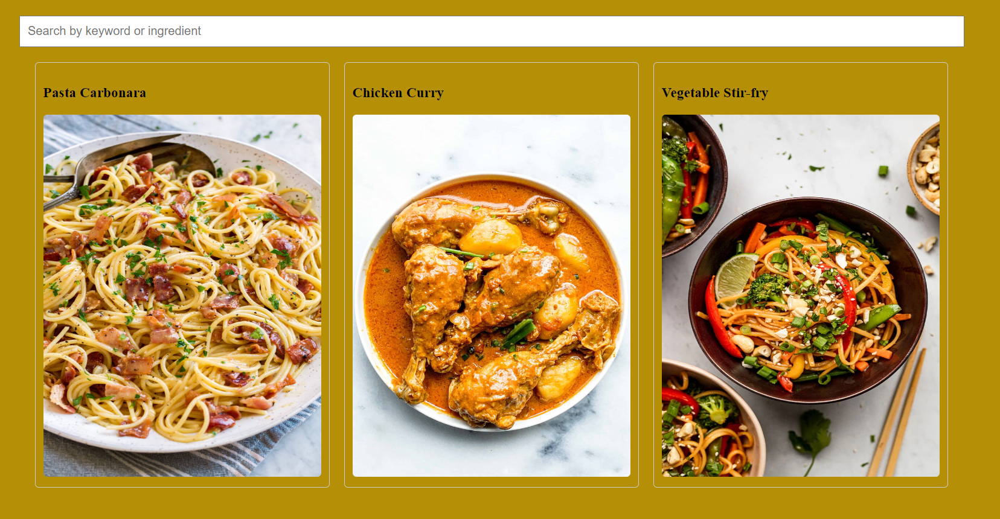

#  RECIPE APP

## Table of contents

- [Overview](#overview)
  - [Screenshot](#screenshot)
  - [Links](#links)
  - [Built with](#built-with)
  - [Author](#author)
  

## Overview

Users should be able to:

- Allowing users to search for recipes by keyword or ingredient
- View ingredients and instructions by clicking on a recipe.

### Screenshot (desktop and mobile view)

### Links

- Live Site URL: [live site URL]( https://koded247.github.io/Recipe-app-proj/)

### Built with

- Semantic HTML5 markup
- CSS custom properties
- Flexbox
- CSS Grid
- javascript

## Author

- AKOREDE ABIDOYE

THANKS 